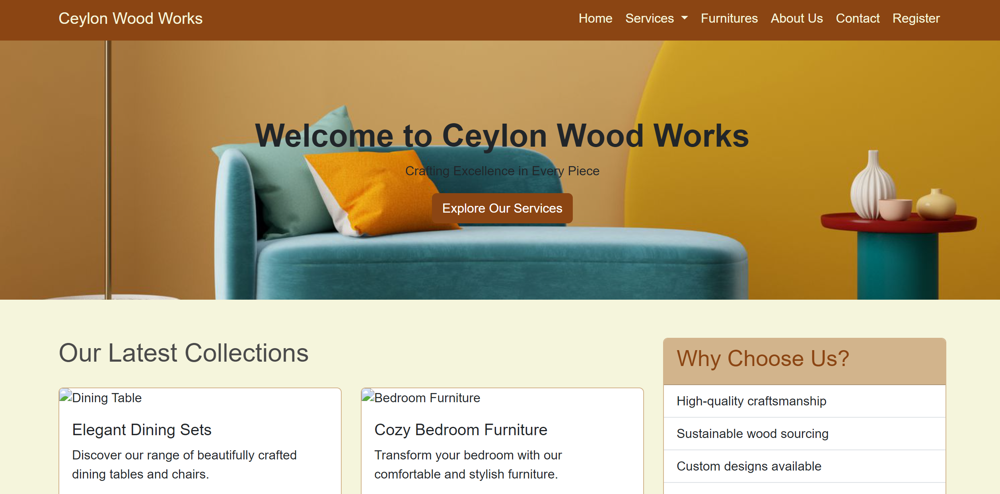

# 🪑 Ceylon Wood Works - Furniture Management System 



## 🌟 Overview
Ceylon Wood Works is a comprehensive web-based furniture management system that helps manage inventory, sales, and customer interactions for a wood furniture business.

## ✨ Key Features
- 🛋️ Furniture Catalog & Management
- 🌳 Tree Buying Portal
- 🪚 Finished Planks Marketplace
- 🎨 Paint Sales Section
- 📦 Rental Items Management
- 👤 User Profile Management
- 🛒 Order Processing System

## 🛠️ Technologies Used
- Frontend: HTML5, CSS3, Bootstrap 5
- Backend: PHP
- Database: MySQL
- Additional: JavaScript, jQuery

## 📋 System Requirements
- PHP 7.4+
- MySQL 5.7+
- Web Server (Apache/Nginx)
- Modern Web Browser

## 🚀 Installation
1. Clone the repository
```bash
git clone https://github.com/yourusername/ceylon-wood-works.git
